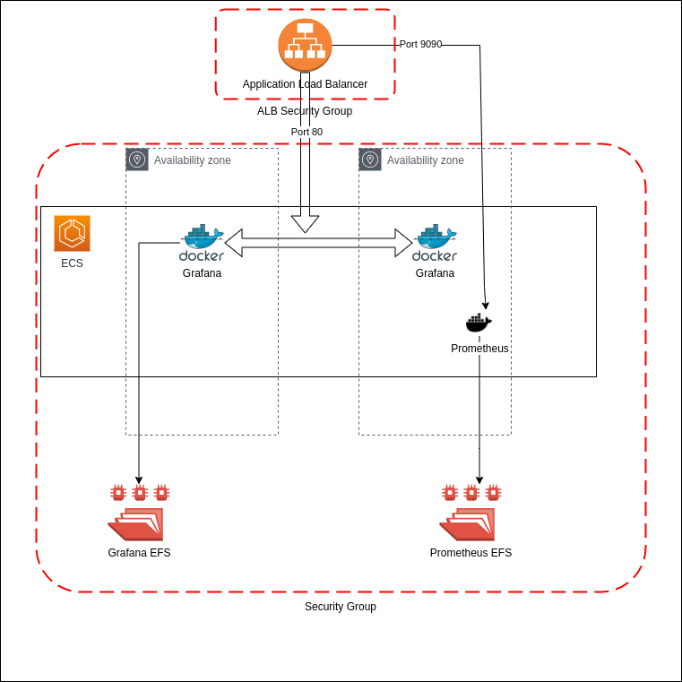

# Grafana and Prometheus on AWS ECS
Deploying Grafana and prometheus container service, on AWS ECS with high availability. 

## What resources are created
1. One ECS cluster with two service 
2. Two EFS volume for grafana and prometheus
    - Creating mountpoints 
3. Application Load balancer (Internet Facing) for both service.
   - 80 port for grafana 
   - 9090 port for prometheus
4. Two target groups 
5. ALB security Group 
6. ECS and EFS security Group


## Diagram


## Grafana Container Info
1. Garafana use following mount point
   - 1.1. grafana_config  -> /var/lib/grafana/
   - 1.2. grafana_dashboard -> /etc/grafana/provisionin/dashboards
   - 1.3. grafana_datasource -> /etc/grafana/provisionin/datasource
2. Port - 3000 
3. environment 
      ```
      3.1 name  = "GF_SECURITY_ADMIN_USER"
          value = "admin"
      3.2 name  = "GF_SECURITY_ADMIN_PASSWORD"
          value = "admin"
      3.3 name  = "GF_USER_ALLOW_SIGN_UP"
          value = "false"
      3.4 name  = "GF_SMTP_HOST"
          value = "mail
      ```
## Prometheus Container Info
1. Prometheus uses following mount point
    - 1.1 prometheus -> /etc/prometheus
	- 1.2 prometheus_data  -> /prometheus
2. Port - 9090
3. Command Patameters - 
   ```
        --config.file=/etc/prometheus/proetheus.yml
        --storage.tsdb.path=/promtheus
        --web.console.libraries=/etc/prometheus/console_librairies
        --web.console.templates=/etc/prometheus/consoles
        --web.enable-lifecycle
        --web.external-url=http:/
   ```

## Pre-requisites
Before we get started installing the Prometheus and Grafana stack on AWS.

- Ensure install the latest version of terraform is installed
- Create the IAM access role for ecsTaskExecutionRole
- Create the VPC and at least two subnets 

## Installation and configuration
- Clone the direcotry
- prepare the .tf files
- In data.tf file pass the iam role name and vpc ID with tag name 
  ```
		data "aws_iam_role" "ecs_role" {
		  name = "YOUR_IAM_TASK_EXUXATION_ROLE"
		}
		data "aws_subnet_ids" "subnet" {
		  vpc_id = "YOUR_VPC_ID" ## change it 
		  tags = {
		    access-team = "YOUR_VPC_TAG"
	    }
  ``` 
- Make changes in value.auto.tfvars as per your requirments 


```bash
terraform init 
terraform apply
```
